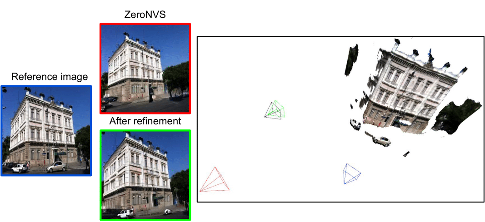

# Geometric Consistency Refinement for Single Image Novel View Synthesis via Test-Time Adaptation of Diffusion Models

[**CVPRW EDGE25**](https://cvpr25-edge.github.io/)

[Josef Bengtson](https://www.chalmers.se/en/persons/bjosef/),
[David Nilsson](https://www.chalmers.se/personer/davini/),
[Fredrik Kahl](https://fredkahl.github.io/)

Chalmers University of Technology


[**Paper**](https://gc-ref.github.io/static/pdfs/gc-ref-final.pdf) | [**Arxiv**](https://arxiv.org/abs/2504.08348) | [**Project Page**](https://gc-ref.github.io/) <br>

This repository is built based on MegaScenes [offical repository](https://github.com/MegaScenes/nvs)

## Introduction
We present a method for refining the geometric consistency of images generated by diffusion based single image novel view synthesis methods.



The single image novel view synthesis task is to, given a reference image and a relative pose, generate an image of the scene from the target pose. The estimated pose for an image generated by the diffusion based method ZeroNVS is shown in red and our refined estimate is depicted in green. The reference pose is shown in blue and the target pose in black. As can be seen, the estimated relative poses from the image generated by the diffusion model can differ significantly from the target pose. Our method refines such images to better align with the target pose. 
## Installation
We recommend creating a [conda](https://www.anaconda.com/) environment then installing the required packages using the following commands:

```
conda create -n gc-ref python=3.8 pip --yes
conda activate gc-ref
bash setup_env.sh
```

Additionally, install Depth Anything following the instructions from the official [repository](https://github.com/LiheYoung/Depth-Anything).


### Downloading Pretrained Models 
Instructions for downloading checkpoints for the pretrained models can be found in the original [MegaScenes repository](https://github.com/MegaScenes/nvs?tab=readme-ov-file#downloading-pretrained-models)

### Data
We use a subset of the MegaScenes dataset for validation and testing. This subset can be downloaded from [here](https://drive.google.com/file/d/1jUh04gDmcpAnyX4q38vDixyA91lVZJy9/view?usp=sharing).
## Usage
### Inference 

The following script can used to run the consistency refinement. Code has been tested using an A40 GPU.

```
bash ./gc-ref.sh --split_type "test" --num_opt_steps 35 --chkpt_name "megascenes" --exp_name "DevRelease/megascenes/" --alpha_rgb 2.5 --certainty_threshold 0.15 --lr 0.025 --seed 1 --az_start 15 --az_end 15 --az_step 1 --scene_name 0
```

### Evaluation
The following script can be run to evaluate geometric consistency of generated images.
```
python eval_pose_accuracy.py --exp_path <path to experiment>
```
Where `<path to experiment>` is a path to the experiment directory that should contain a folder by name `scenes` that contains the generated results for the scenes to be evaluated. 
## Contact
I can be reached at [bjosef@chalmers.se](bjosef@chalmers.se) for any questions regarding the code or paper.
## Cite this work
If you find our code or paper useful, please consider citing
```bibtex
@inproceedings{gc-ref,
  title={Geometric Consistency Refinement for Single Image Novel View Synthesis via Test-Time Adaptation of Diffusion Models},
  author={Bengtson, Josef and Nilsson, David and Kahl, Fredrik},
  booktitle={IEEE/CVF Conference on Computer Vision and Pattern Recognition (CVPR) Workshops},
  year={2025}
}
```

